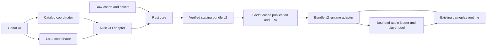

# Godot + Rust 技术栈迁移可行性与执行风险报告

审查日期: 2026-09-19. 审查基线: `d4cedf802e22a4eefd08426ddba17f3cd17c2856`.

本报告基于当前工作区的设计、执行计划、Java/Godot/Rust 实现、测试与构建配置. 文中区分当前代码事实、历史验收记录、当前验证输出和建议调整. 本轮仅新增报告, 不修改实现、既有计划、golden corpus 或运行时配置. 工作区原有未跟踪的 `mise.lock` 保持原状.

## 1. 结论与建议

**建议继续采用 Godot + Rust native CLI 方案, 但应先修订 Phase 1 的数据合同, 并提前验证 VOS 合成性能和 macOS 打包. 目前可以确认架构方向合理, 不能确认当前计划已完整闭合, 也不能承诺所有加载 SLO 已可达.**

主要判断:

1. **迁移已有可复用基础.** Godot 已实现 gameplay、输入、判定、渲染、设置和结算. 剩余重点是替换 Java 导入与音频导出链路, 并补齐 catalog、缓存、进度、取消和发布能力.
2. **Rust 实现仍处于早期.** 当前 CLI 仅实现 `version`, 宣告的 catalog/bundle 格式能力均为空. Phase 1 Task 1 有历史完成记录; Task 2 已提交协议测试, 相应生产模块尚不存在. 不能把九个 Task 或七个 Phase 等权换算为迁移完成率.
3. **当前计划存在会导致返工的具体合同问题.** 包括 OJN 音量/声像精度损失、时间与滚动语义表达不足、多曲库根目录的身份冲突, 以及 bundle v2 到现有 Godot runtime 的适配工作未明确成独立交付项.
4. **最大技术不确定性是 VOS 冷加载与实际音频体验.** 历史设计记录的 VOS selected export 为 31.09 s, 目标 cold P95 为 5 s. 固定 SoundFont 已落实, 合成器选择、确定性、吞吐和实际播放同步尚未形成完整证据.
5. **目前不满足 Java 删除条件.** Godot 生产路径仍启动 Java, 构建和发布仍为 Maven/JAR/jpackage, 没有 Godot macOS export preset, 当前整体验证也并非全部绿色.

建议决策: 批准技术方向, 暂缓冻结现有 Phase 1 全部接口, 在合同修订与两个可行性原型通过后继续实施. 本报告不建议重做已有 gameplay, 也不建议此时引入 GDExtension.

## 2. "整个项目迁移"的范围

仓库已接受的目标是迁移 **Godot Product Contract**, 并最终删除所有可执行 Java 依赖. 它不等于保留历史 Java 应用的每一项功能.

| 范围 | 本次迁移定义 |
|---|---|
| 必须支持的输入 | VOS, O2Jam OJN/OJM, osu!mania 7K `.osu`/`.osz`, bundle v2 |
| 必须支持的体验 | 扫描、搜索、Song/Chart 分组、选曲、导出、音频、gameplay、设置、进度、取消、缓存 |
| 必须移除的技术依赖 | 产品运行、开发构建、测试门禁、发布包中的 JRE/JDK/Maven/JAR/Java fallback |
| 明确退役 | Swing/LWJGL 应用, BMS/SM/SNP; 既有 Godot 验收记录还明确移除了 Partytime/本地联机范围 |
| 首发硬平台 | macOS Apple Silicon, 签名 Godot application |
| 后续平台 | macOS x86_64、Windows、Linux 安装包不阻塞首发, 数据合同应保持可移植 |
| 旧派生数据 | Java v1 catalog/bundle/audio cache 不读取、不迁移、不自动删除 |
| 必须保留的数据 | 原始歌曲、歌曲目录、用户设置、键位、gameplay 配置 |

依据: [产品合同](/Users/honghao.shan/workspace/personal/vos-mac/CONTEXT.md:31), [迁移设计](/Users/honghao.shan/workspace/personal/vos-mac/docs/superpowers/specs/2026-07-11-java-free-song-loading-design.md:1).

如果"整个项目"还包含旧 BMS、视频 BGA、SM/SNP 或联机能力, 当前批准的范围就不够, 需要增加独立能力清单和迁移阶段. 本报告按仓库既定产品合同评估, 不将这些能力默认算作已覆盖. README 仍主要描述旧 Java 产品, 正式切换时必须同步更新.

## 3. 当前进度与证据强度

### 3.1 实现状态

| 工作项 | 当前事实 | 判断 |
|---|---|---|
| Godot gameplay | 存在 runtime/controller/view, judgment、score、latency、input、result 等模块; 测试目录有 70 个 `.gd` 脚本, 包括测试、探针和 profiling 脚本 | 有较完整可复用实现, 脚本数量不等于本轮通过数量 |
| Java/Godot 视觉与行为对齐 | 2026-07-02 报告记录 VOS/OJN/OSU 截图和 oracle 验收, 接受有限渲染边缘差异 | 历史证据, 非当前 HEAD 的重新验收 |
| Phase 0 golden | 27 个自编 logical cases, VOS/OJN/OSU 分布为 7/10/10, 有 provenance 和内容校验 | 可用迁移基础, 不代表真实曲库覆盖完备 |
| SoundFont | GeneralUser GS 2.0.3, 固定约 32.3 MB 资源、SHA-256、来源、许可证和 owner acceptance | 已解决资源选择与批准记录问题 |
| Rust workspace | Rust 1.96.1, edition 2024, 两个 crate, committed Cargo.lock | 已建立 |
| Rust CLI | 仅 `version` 成功路径; `catalog`/`bundle` 只出现在 usage 文本 | 尚不能转换任何产品格式 |
| Phase 1 Task 2 | 已存在 `protocol_contract.rs` 与 JSON fixtures; `digest/error/format/id/json/path/protocol/schema` 均未实现 | 测试先行的未完成状态 |
| Native parser/音频 | 未发现 VOS/OJN/OSU Rust importer、timing compiler 或 synth 实现 | 待开发 |
| Catalog v2/UI | 当前 catalog loader 只接受 schema 1; 主 UI 仍逐条创建按钮与 metadata | 待迁移 |
| Artifact cache v2 | 当前只判断若干文件是否存在, 没有 strong-key/manifest/LRU 完整链路 | 待开发 |
| 进度/取消 | selected export 在 Thread 中调用阻塞式 `OS.execute`, 没有 PID 所有权和 cooperative cancel 合同 | 待替换 |
| 发布 | CI 构建 JAR 与 jpackage app; 没有 Godot export preset | 尚未切换 |

关键实现依据: [CLI](/Users/honghao.shan/workspace/personal/vos-mac/native/crates/open2jam-cli/src/main.rs:8), [空能力列表](/Users/honghao.shan/workspace/personal/vos-mac/native/crates/open2jam-core/src/version.rs:19), [Rust crate root](/Users/honghao.shan/workspace/personal/vos-mac/native/crates/open2jam-core/src/lib.rs:1), [Java bridge](/Users/honghao.shan/workspace/personal/vos-mac/rewrite/godot/scripts/exporter_client.gd:1), [进度账本](/Users/honghao.shan/workspace/personal/vos-mac/docs/superpowers/plans/2026-07-12-java-free-phase1-progress.md:9).

### 3.2 当前验证输出与限制

| 验证 | 当前输出 | 能证明什么 |
|---|---|---|
| mise 环境 | Java Zulu 17.0.19, Maven 3.9.9, Rust 1.96.1 均可解析 | 项目声明的三个工具已安装 |
| Golden manifest SHA-256 | 校验命令退出 0 | 已冻结文件内容与 manifest 一致 |
| Production SoundFont verifier | 退出 0, completed snapshot audit passed | 固定 SoundFont 合同一致性通过, 不证明合成器行为 |
| 两组核心 oracle 测试 | `MigrationGoldenCorpusTest` 6 项, `MigrationGoldenInputOracleTest` 4 项; 0 failures/errors/skips | 这 10 项验证通过 |
| `mise run verify-goldens` | 退出 1, `Nested TMPDIR changed the JVM temp root` | 完整 Phase 0 门禁当前未通过; 不能用窄测试替代它 |
| 默认 Rust workspace test | 退出 101, SDK 27.0 的 `.tbd` 出现 `unknown architecture: arm64e.x1` | 当前默认 native 工具链组合在链接阶段受阻 |
| 单次诊断指定现有 SDK 26.5 | workspace test 进入源码编译, 因协议模块缺失报 E0432/E0433 | 除环境问题外, 当前 Rust workspace 确有未完成实现 |
| 同一诊断 SDK 下的 CLI version test | 1 passed, 0 failed, 0 ignored | 版本握手的窄验证可通过 |
| Godot | shell 返回 `command not found`; 常见 Homebrew/Godot.app 路径也不存在 | 本轮无法复验 headless、画面、真实音频或 package |

SDK 26.5 仅用于单次命令诊断, 没有修改 mise、shell profile 或系统选择. 报告不把该诊断视为正式构建环境修复.

当前日志: [完整 golden gate](/tmp/vos-mac-migration-review-goldens-20260919.log), [golden 文件校验](/tmp/vos-mac-migration-review-integrity-20260919.log), [核心 oracle 测试](/tmp/vos-mac-migration-review-oracle-tests-20260919.log), [Rust 协议编译诊断](/tmp/vos-mac-migration-review-native-20260919.log). `/tmp` 日志是临时证据, 长期审计应归档至 CI artifact.

历史 Phase 0 完成记录仍有参考价值, 但今天的环境和当前 HEAD 必须有独立门禁结论. 当前状态不能表述为"所有迁移基础 gate 都通过".

## 4. 总体技术架构评估

推荐保留 ADR 0002 的职责划分:



| Module | 应承担的责任 | 应避免承担的责任 |
|---|---|---|
| Rust core | 二进制解析、格式规则、timing 编译、解密、音频准备、确定性 identity、bundle 内容完整性 | UI 状态、场景切换、Godot 对象、LRU 策略 |
| Native CLI adapter | version/request/result/progress、文件 transport、退出码、取消检查 | 第二套领域实现、长期后台服务 |
| Godot coordinators | generation、选择状态、任务优先级、预热复用、UI 进度、缓存预算 | 在 GDScript 中再次实现复杂谱面 parser |
| Bundle v2 runtime adapter | schema 校验、相对路径解析、sample identity 映射、单位和字段转换 | 重新推导或偷偷修改谱面语义 |
| Godot runtime | 输入、判定、渲染、播放调度、结果、设置 | 启动 Java 或执行冷合成 |

这是一个合理的 seam: 复杂导入行为集中在 Rust module, Godot 使用少量稳定的 Interface 消费结果. CLI 只在加载阶段跨进程, 不在每帧或每个音符上通信, 因而 IPC 通常不是最先优化的地方. 现有历史测量中空 Java CLI 约 0.07 s, VOS 音频导出约 29.34 s, 也支持将优化重点放在工作量和资源准备上.

技术方案比较:

| 方案 | 优点 | 代价与使用条件 | 建议 |
|---|---|---|---|
| Godot + Rust CLI | 导入崩溃隔离, 无 Godot ABI 耦合, 易于独立测试与 fuzz, 可复用 core | 需处理 helper 生命周期、文件协议和签名 | 首选 |
| Godot + Rust GDExtension | 直接传值, 可减少文件交换, 更适合确有需要的实时 native 工作 | 崩溃影响主程序, 引擎版本与绑定/打包更紧密 | 仅在端到端 benchmark 证明 CLI seam 阻碍预算时评估 |
| Godot + 纯 GDScript importer | 部署结构较少 | VOS/MIDI、OJM 解密、复杂 I/O 与确定性测试成本较高 | 不建议用于本项目原始格式层 |

官方 Godot 4.6 提供 `OS.create_process`、进程状态与终止方法, 因而 native helper 调用不存在引擎能力缺口. 但 helper 不会随 Godot 自动退出, 需要显式生命周期策略. 见 [Godot OS 文档](https://docs.godotengine.org/en/4.6/classes/class_os.html).

## 5. 应在继续冻结合同前解决的问题

### 5.1 高优先级: 音量与声像的数据类型会丢失 OJN 语义

Phase 1 Task 3 规定 `volume: u8` 为 `0..=100`, `pan: i16` 为 `-100..=100`. Java OJN parser 则使用:

```text
volume = nibble / 16
pan = (nibble - 8) / 8
```

因此 `1/16 = 6.25%`, `1/8 = 12.5%`, 无法无损存入整数百分比. 这与"保留 volume/pan semantics"和"零未解释 semantic difference"直接冲突.

建议使用能精确覆盖现有格式的固定精度, 例如音量 `0..10000`、声像 `-10000..10000`, 或明确的有理数. 对当前 OJN 和 osu 百分比, 万分制足够且更简单. 在进入 runtime 时再转换为播放所需浮点数, 禁止 importer 默默取整. 需覆盖全部 nibble 值, 尤其是 `0` 的特殊默认语义.

依据: [OJN 解析](/Users/honghao.shan/workspace/personal/vos-mac/parsers/src/org/open2jam/parsers/OJNParser.java:224), [Phase 1 类型约束](/Users/honghao.shan/workspace/personal/vos-mac/docs/superpowers/plans/2026-07-12-java-free-phase1-rust-core.md:1156).

### 5.2 高优先级: 领域模型尚不足以完整表达已有 timing 与长音语义

计划中的 `Chart` 只有一组 `timing`, `TimingPoint` 只有时间、tempo、meter 和 source order; 没有明确的 scroll-speed 事件或独立 visual timing. 然而 osu parser 将 inherited timing 作为 `SCROLL_SPEED`, Java 编译器分别产生 judgment/visual timing, Godot loader 也要求两者.

同样, 计划 `Note` 只有 start/end 和一个 source order, 未显式保存现有 loader/runtime 使用的 `measure`、`endMeasure` 和 `releaseEventOrder`. 这些字段影响 measure-based random 和同一时刻长音尾部/新音符的先后处理. 若在规范化时丢弃原始顺序, 后续不能仅靠开始/结束时间可靠恢复.

建议在 Task 3 前建立"旧 gameplay 字段 -> 新领域语义 -> v2 wire 字段 -> Godot 消费者"映射表, 至少包含:

- judgment timing 与 visual/scroll timing 的区分.
- measure 变化与 marker, 初始 1500 ms delay 的所有权.
- 长音头尾各自的 source order, 同时间事件的 tie-break 规则.
- `sampleId=0` 静音语义、BGA/cover 引用和 autoplay 顺序.
- Java 浮点毫秒到 Rust 整数微秒的明确舍入规则与允许差异.

采用整数微秒是合理选择, 但不能把数据类型更严格等同于语义更完整. unsigned time 对负 timing offset/前置事件的归一化规则也应在 importer fixtures 中说明.

依据: [Rust 领域草案](/Users/honghao.shan/workspace/personal/vos-mac/docs/superpowers/plans/2026-07-12-java-free-phase1-rust-core.md:1088), [时间编译器](/Users/honghao.shan/workspace/personal/vos-mac/src/org/open2jam/render/RenderTimingCompiler.java:1), [旧 exporter 合同](/Users/honghao.shan/workspace/personal/vos-mac/src/org/open2jam/export/VosGameplayExporter.java:43), [Godot loader](/Users/honghao.shan/workspace/personal/vos-mac/rewrite/godot/scripts/gameplay_loader.gd:47).

### 5.3 高优先级: 多 root 与可迁移身份之间的冲突未解决

计划允许多个 absolute roots, 但 `SongIdentity::ojn_file` 仅接受 root-relative path, 并要求 root relocation 后 identity 不变. 如两个 root 都包含 `album/song.ojn`, 当前规定的 hash 输入相同, 即使它们实际是不同歌曲包. VOS 同相对路径、同 identity title 也有类似问题.

这属于合同缺口, 尚不是已上线碰撞. 需要同时定义:

1. 不同来源目录的歌曲不会误合并.
2. root 移动后, 原有歌曲身份可以保留.
3. overlapping roots、重复扫描同一文件、同一包复制到另一个 root 的预期行为.
4. bundle 声明身份与原始源身份的关系.

一个可行方向是为配置的 root 持久化稳定 namespace, 以 namespace + relative package identity 区分来源; root 移动保留 namespace. 内容 fingerprint 与展示身份分开, bundle declared IDs 保持不变. 若希望复制包跨机器天然共享 Song ID, 则需要进一步定义 package identity, 不能直接回退到标题或绝对路径哈希.

依据: [identity 构造函数与 hash 合同](/Users/honghao.shan/workspace/personal/vos-mac/docs/superpowers/plans/2026-07-12-java-free-phase1-rust-core.md:729).

### 5.4 高优先级: "保留 Godot runtime"仍需要明确的 v2 适配层

现有 Godot 代码接受 schema 1、整数 sample ID、绝对 WAV path、`OJN/OSU/VOS` 格式名. 新计划使用 schema 2、hash-based SampleId、相对路径、`O2JAM/OSU_MANIA` 格式名, 并允许多个 audio kind. 修改 CLI 路径本身不能完成迁移.

建议显式增加 `Bundle v2 runtime adapter` 交付项:

- bundle loader 负责从可信 bundle root 解析相对路径.
- 为 hash-based SampleId 建立稳定的内存 dense-index 映射, 同时转换 notes、autoplay 和 audio assets; 不截断 hash 充当 ID.
- 明确外部 audio kind 与最终 runtime 文件格式的关系. 如首期全部输出 WAV, 将该约束写入 wire 合同; 如保留 OGG/MP3, 要同步支持 loader 和实际音频测试.
- 整数微秒只在 adapter 转成 runtime 的毫秒; 不让单位转换散落到 controller/view.
- 冻结已有 runtime state trace, 比较 adapter 前后的判定、长音、得分、音频命令与结算.

建议在 Phase 1 结束前用手工 v2 fixture 做一次纵向验证, 最迟在 Phase 2 第一条真实 OJN 链路时完成. 不应等到 Phase 5 才发现 wire 合同无法被消费者使用.

依据: [audio manifest loader](/Users/honghao.shan/workspace/personal/vos-mac/rewrite/godot/scripts/audio_manifest_loader.gd:31), [gameplay loader](/Users/honghao.shan/workspace/personal/vos-mac/rewrite/godot/scripts/gameplay_loader.gd:47).

### 5.5 高优先级: VOS 可行性验证安排过晚

Roadmap 将 VOS 和 synth go/no-go 放在 Phase 3; Phase 1 末尾又要求 Phase 2 结束前不开始 VOS/MIDI 工作. 这保证了实施顺序, 但会把最有可能改变设计的性能风险推迟.

建议修订计划, 允许提前做不接入生产的限时原型, 正式 importer 的开发顺序仍可保持. 原型必须使用已批准的 GeneralUser GS 2.0.3, 覆盖代表性 VOS 的完整 MIDI 工作量, 输出 release build 的 wall time、总 PCM bytes、RSS 和每阶段耗时.

SoundFont 已有 owner acceptance, 不需要再次重复选择或请求批准. 真正未确定的是 synth engine 及其行为/性能. 可先评估纯 Rust 的 RustySynth: 官方项目支持离线 SoundFont/MIDI 合成, 可作为候选. 这并不证明它满足本项目 SF2 特性、确定性或 5 s 预算, 必须以 fixtures 和原型筛选. 见 [RustySynth 官方仓库](https://github.com/sinshu/rustysynth).

若候选不通过, 再比较其他 synth stack. 依赖选择应同时评估精度、状态重置、可取消性、部署成本和许可证, 不以"纯 Rust"作为唯一决定因素.

### 5.6 中高优先级: 性能预算与强完整性校验需要共同设计

Strong key 依赖 source/companion 全量内容 hash, bundle 又要求逐文件校验. Phase 1 staging 计划包含 private-root verification、rename 后 verification, 消费端还要再次验证. 安全性与事务设计合理, 但可能造成多轮相同 I/O.

特别是 warm path: 已有缓存不代表几乎无工作, 还需检查 source 是否变化、artifact 是否完整、加载 JSON 和启动音频. 一个很大的 OJM 或大量 WAV 足以让 hash/metadata I/O 成为主耗时.

建议:

- 给 `HASH_SOURCES`、`VERIFY_BUNDLE`、音频加载分别计时, 在第一次纵向切片就测 warm/cold.
- 保持强校验, 先测清同一产物被读取几次, 不用"文件存在"代替 correctness.
- 决定 bundle verifier 的唯一语义维护位置. 若 Rust/GDScript 各实现一套, 必须共用 adversarial corpus 和一致的 accept/reject 合同; 较好的方向是 Rust 提供完整校验行为, Godot 保留 generation、结果绑定和缓存发布决策.
- 如需扩展 CLI 校验命令或调整消费接口, 先更新 ADR/协议, 不隐式改动既有 ownership.

### 5.7 中高优先级: 进程生命周期、取消与重启恢复还需补全

当前 `selected_export_job.gd` 的后台 Thread 避免了部分主线程阻塞, 但没有可取消进程模型. 新设计的 generation + cancel marker + PID 是正确方向, 还应加入:

- Godot 正常退出、崩溃、重启后的 orphan helper 策略.
- 清理 stale staging 前确认没有仍存活的 writer, 不能仅凭"不是当前 generation".
- 多窗口/多实例是显式禁止, 还是共享缓存并支持独立 session; 首期单实例更简单.
- progress JSONL 的半行读取、最大行长、每帧处理上限、sequence 错误和超时.
- 取消标记优先于晚到成功; result、jobId、bundle key 与当前选择必须绑定.
- 单个超大 MIDI sample 内部也有 bounded cancellation checkpoint, 避免只能等待整条 sample 完成.

这些是产品取消/恢复语义, 不需要扩张为防御恶意同 UID 进程的通用安全框架. Godot helper 独立存活的行为有官方说明. 见 [OS.create_process](https://docs.godotengine.org/en/4.6/classes/class_os.html#class-os-method-create-process).

### 5.8 中高优先级: 发布与设置路径需要提前验证

现有 `mise run godot` 先构建 JAR; `mise run app` 仍调用 jpackage; CI 不执行 Rust 全量门禁或 Godot suite. 最终阶段才尝试原生发布, 会集中暴露较多外部条件.

建议 Phase 1 附近先产生一个 Godot + `converter version` 的 macOS app 原型, 检查 app 内 helper 路径、执行权限、启动目录无关性、签名和目标架构. 首发若面向普通下载分发, 应将 Developer ID 签名、公证和 stapling 纳入发布定义, 仅有本地 ad-hoc 签名不足以代表普通用户的 Gatekeeper 体验. 见 [Godot macOS export 文档](https://docs.godotengine.org/en/4.6/tutorials/export/exporting_for_macos.html).

另一个容易漏掉的迁移点是设置目录. 当前应用名为 `Open2Jam VOS Rewrite`, 设置保存在 `user://settings.cfg`. Godot 默认 user directory 与项目名有关. 发布时若改成 `VosMac`, 应固定数据目录或提供一次性、非破坏性的设置复制, 否则"用户设置继续保留"可能不成立. 见 [Godot data paths](https://docs.godotengine.org/en/4.6/tutorials/io/data_paths.html).

## 6. 各技术模块的可行性与验证重点

### 6.1 OJN/OJM: 可行, 主要风险是细节兼容

Java parser 可作为明确行为参考. 需要覆盖三难度、7K channel/autoplay mapping、sample namespace、音量/声像 nibble、plain OJM、OMC 17-block rearrangement/stateful XOR 和 M30 两种 XOR key.

Java OMC decoder 使用 static `acc_keybyte`/`acc_counter`, Rust 不应复制为共享全局状态. 每个 importer 拥有自己的状态, 并验证多文件顺序、逆序和并行读取结果一致. 参考 [OJM parser](/Users/honghao.shan/workspace/personal/vos-mac/parsers/src/org/open2jam/parsers/OJMParser.java:304).

### 6.2 osu!mania: 可行, 需区分格式支持与完整官方玩法模拟

按本项目既定 7K 子集迁移, 保持 `.osu/.osz`、Unicode metadata、inherited scroll speed、custom hitsounds、缺失音频和相对资源查找语义. 不应默认声称兼容所有 osu!mania 行为.

OSZ 除 traversal/absolute path 拒绝外, 还需要条目数量、总解压字节、单文件大小、异常压缩比和处理时限等明确预算. 大小写不敏感 fallback 遇到多个匹配时必须确定性处理, 避免依赖目录枚举顺序.

### 6.3 VOS: 可行性有条件成立, 是迁移关键路径

复杂性包括容器、GB2312、可玩通道推断、两组 tick scale、MIDI running status/tempo、背景与 live 分离、去重及 note gate/tail. 这些规则不是"读取音符数组"即可替代.

现有 Java renderer 每条 MIDI sample 都打开 synth 并加载音色, exporter 串行写出全部 WAV, 提供了优化空间. Rust 可评估共享只读 SoundFont、独立 synth worker、内容去重和有界并行. 但必须验证 worker reset, 防止 bank/program、sustain、pitch bend、effects 状态泄漏.

确定性合同还应固定 synth 版本、配置、渲染 block size、effects、float-to-PCM 舍入与 clipping 规则. SoundFont hash 相同不代表不同 synth 版本生成的 PCM 相同. renderer contract 的变化必须进入 cache invalidation.

PCM 下界可用于容量与性能评估:

```text
44100 frames/s * 2 channels * 2 bytes = 176400 bytes/s
180 seconds of stereo PCM = 31.75 MB
```

所有独立 keysound 的 gate/tail 累加后, 总输出可能远大于歌曲本身时长对应的 PCM. 因此"任意大小合法谱面均 cold <= 5 s"不是可验证的无限范围承诺. 必须固定支持规模、代表性工作集及超限处理.

### 6.4 Godot 音频与 gameplay: 保留实现, 增加真实时序验收

当前 runtime 由 `_process(delta)` 累加时间, pool 每次播放创建新 `AudioStreamPlayer2D`, 已读代码没有 finished 后复用固定容量 player 的路径. 当前预加载也逐 sample 启动 Thread, 并非规划中的固定 worker pool.

迁移时应实现有界 worker、first-use lookahead、固定 player pool, 并定义 pool 满时的优先级策略. 不能静默丢弃 BGM 或关键长音; event trace/debug log 也需要容量控制.

真实音频 device 的起播延迟、混音 block、长时间 drift 和输入延迟, 不会被 headless state trace 或截图证明. Godot 官方说明了系统时钟补偿与音频播放位置补偿两种方式. 本项目可先保持 gameplay 状态模型, 验证单调时钟与起播补偿是否足够; 只有测量显示长曲漂移需要修正时再增加同步控制. 见 [Godot audio synchronization](https://docs.godotengine.org/en/4.6/tutorials/audio/sync_with_audio.html).

### 6.5 Catalog/cache/UI: 设计方向正确, 当前仍有较多实施量

已有 main UI 搜索匹配 title、artist、完整路径, 每次过滤重建完整 Control 列表, 选曲直接加载. 它与新合同的 title/basename 搜索、Song 分组、独立 Difficulty Selection、虚拟列表不同.

拆出 Catalog Coordinator、Load Coordinator 和虚拟列表属于当前迁移所需的职责拆分, 无需重构整个 UI 框架. 缓存索引先开放交互, 后台刷新; 搜索不得触发 CLI 或磁盘扫描. 需要保留 selection/scroll, 并区分单个坏文件和整个 root 暂不可用.

全局 MIDI sample cache 与 relocatable bundle 的关系也需明确. 首期可优先复用合成结果, bundle 保持自包含; 不应通过引用 bundle 外部 CAS 文件破坏可搬移性. 若后续用 hardlink 降低空间, 再明确磁盘计费、引用存活和 LRU/pin 规则.

## 7. 建议调整后的迁移顺序

原 Roadmap 的"冻结事实 -> Rust -> importer -> Godot -> cutover -> 删除"主线正确. 主要调整是前置风险验证、补充消费者纵向切片, 并缩短发现问题的反馈周期. 以下是建议修订, 不是本轮已经执行的实施计划变更.

| 阶段 | 主要交付 | 退出条件 | 与现计划的关系 |
|---|---|---|---|
| R0. 恢复基线与合同修订 | 可复现 Godot/SDK 环境; 更新进度账本; 修订精度、timing、identity、v2 adapter 合同 | 明确 baseline failures; 关键合同无已知矛盾; 不修改 golden expected 掩盖差异 | 新增前置检查 |
| R1. 提前验证高风险点 | VOS synth release 原型; 最小 macOS Godot + helper app; 小型 v2 fixture consumer | synth 确定性与成本有测量; helper 能在 app 内工作; Godot 可消费 v2 | 将部分 Phase 3/6 风险前置 |
| Phase 1. Rust 基础 | 完成 Task 2-9: domain、progress、cancel、identity、transport、verifier、staging、native CI | 全 workspace/doc tests 与 fmt/clippy 通过; malformed/atomicity 通过; capabilities 诚实反映能力 | 保留主体, 先修合同 |
| Phase 2. 非 VOS 纵向切片 | OJN/OJM 与 osu importer; timing; 音频准备; v2 adapter 接入 Godot | raw source -> Rust bundle -> Godot gameplay -> result; 每格式至少一条 hermetic E2E | 增加实际消费者验收 |
| Phase 3. VOS 正式实现 | VOS parser、固定 synth、sample cache、完整音频合同 | 重复/逆序/并行确定性; semantic parity; release cold 路径通过预算 | 在原型已通过后实施 |
| Phase 4. Catalog/UI | Index v2、后台增量 scan、Song/Chart 分组、search/filter、虚拟列表 | 3,919-Chart fixture 的交互 SLO; 搜索无进程/磁盘副作用; LKG fallback | UI/fixture 工作可在稳定接口后开展 |
| Phase 5. 加载与缓存 | generation、prewarm reuse、strong cache、LRU/pin、progress、lookahead、player pool | hit/miss/corruption/mutation/cancel/out-of-space 全链路; warm/cold SLO | 保留, 性能观测提前 |
| Phase 6A. 发布切换 | Godot production 只调用 Rust, signed/notarized app, clean-machine E2E | 空缓存、真实音频输入、无开发工具和外部依赖均通过 | 与 Java 删除拆开验收 |
| Phase 6B. 删除 Java | 删除源码/构建/测试执行器/桥接器/旧发布; 替换 Java verifier; 保留只读 provenance | 从无 Java 环境可构建、测试、打包、运行; 最终全门禁通过 | 最后执行 |

建议采用可验证的里程碑, 不以"某个 crate 写完"作为唯一进度单位:

1. 首个 native OJN 可以从原始文件进入 Godot 并完成结算.
2. 首个 native OSZ 可以解析、播放 BGM/custom sample 并保留 inherited scroll.
3. 代表性 VOS 从空缓存进入 gameplay, 音频与时间合同通过.
4. 大曲库的搜索/选曲和加载目标通过.
5. 干净机器打开发布 app, 不存在 Java fallback.
6. 无 Java 的开发构建与发布闭环通过.

现有 spec 与 roadmap 使用了不同的 Phase 编号含义. 建议以较新的 roadmap 为执行索引, spec 只描述架构/约束, 避免"Phase 3 已完成"在不同文档中指向不同交付. 账本的 Task 2 应标记为测试已提交、实现待完成, 而非笼统 Pending.

实施过程可以按独立职责分工, 但协议、schema、golden 和集成分支需要明确单一负责人. 原计划依赖的执行技能应在开始实施时确认可用; 本轮评估不执行生产修改或计划中的代理调度.

## 8. 性能验收设计

### 8.1 保留现有 SLO, 补齐测量定义

| 路径 | 已批准目标 | 必须明确的条件 |
|---|---|---|
| Start -> Song Selection Ready | warm P95 <= 300 ms | cache 已存在; 是否包括 app 冷启动应另列; Ready 包含列表可选和搜索可用 |
| Search/filter | P95 <= 100 ms | 3,919 Chart 工作集; 同时有后台扫描; 记录最长主线程 frame |
| Chart -> Gameplay Ready | warm P95 <= 2 s | strong validation 和开局音频加载均计时, 不只测 CLI |
| Chart -> Gameplay Ready | cold P95 <= 5 s | 所选 Chart 派生缓存为空; 全局 sample cache 命中与否分别报告 |
| Loading UI | <= 100 ms | 用户操作到第一帧可见, 不能在同步扫描之后才开始计时 |
| Playback | 原计划缺少数值预算 | 增加 onset jitter、audio/input offset、长曲 drift、underrun 和内存上限 |

"cold"至少区分应用缓存为空与 OS 文件缓存冷. 不应将 Chart 已预热完成后的 Play 时间冒充首次选择的 cold 时间. 也不应通过后台尚未完成合成就宣布 Ready 来绕过预算: 既有合同要求完整 artifact 已准备.

### 8.2 Benchmark matrix

按原设计组合 1/100/1,000/3,919 Chart 曲库, VOS/OJN/OSU/OSZ/bundle, small/representative/stress audio, hit/miss/mutation/corruption. 另外增加:

- USB/外置盘断开、root 暂时不可读、多 root 相同相对路径.
- prewarm 过程中连续切换 Chart, Play 复用已有 job.
- 最忙场景下的 worker 数、内存、磁盘峰值和 UI frame time.
- 全局 sample cache 为空的 VOS, 避免去重缓存掩盖真实冷成本.
- bundle 搬移到另一目录后独立加载.

使用固定硬件、电源状态、Godot/export template、Rust release build、SDK 和 corpus digest. 记录 p50/p95/max、sample 数/秒数、CPU、peak RSS、I/O bytes、进程数、各阶段时间. 原设计的 warm 30 次/cold 至少 10 次可作为起步, 但少量 cold 样本的 P95 只能作初筛, 正式 gate 应保留全部样本并增加重复批次.

### 8.3 进度百分比

扫描开始时通常还不知道候选总数. 应采用明确的阶段预算 + 真实已完成数量, 待 discovery 完成后冻结该阶段总量. 展示百分比是工作阶段完成度, 不是剩余时间保证. UI 的总体进度不得因新增文件倒退, 100 只能对应 Ready.

异步资源加载也需要消费者检查完成状态; 在资源未就绪时获取仍可能阻塞. 外部 WAV/OGG 的支持路径需以实际 loader 验证, 不能机械套用场景资源加载示例. 见 [Godot background loading](https://docs.godotengine.org/en/4.6/tutorials/io/background_loading.html).

## 9. 风险登记与控制措施

下表的优先级表示对迁移完成的影响, 不表示当前线上事故等级.

| 风险 | 级别 | 影响 | 控制措施/验收 |
|---|---|---|---|
| OJN 音量/声像精度丢失 | 高 | parser 永久输出不等价数据 | Task 3 前修订类型, nibble 全覆盖 |
| visual timing/长音尾部顺序丢失 | 高 | 滚动、Random、hold 判定/播放回退 | schema 映射表, 同时间/跨 measure 回归 |
| 多 root 身份冲突 | 高 | 错误合并歌曲、选错难度、缓存关联错误 | root/package identity 决策与 collision tests |
| VOS cold 5 s 不可达 | 高 | 核心体验与删除门禁无法满足 | 提前 release 原型, profile 后优化, 失败时正式修订目标或架构 |
| synth 顺序/状态不确定 | 高 | 缓存不可复现、跨曲音色污染 | 重复、逆序、并行、worker reset PCM 验证 |
| v2 与 Godot schema 不兼容 | 高 | Rust gate 通过但游戏无法启动 | 早期 fixture consumer + raw-source E2E |
| 取消后旧结果发布 | 高 | 错曲、半成品、后台进程泄漏 | generation/session/job 绑定, fault injection |
| source mutation 与缓存完整性 | 高 | 旧资源误命中或读取损坏产物 | same-handle capture、hash、manifest-last、原子发布、重建一次 |
| 音频播放时钟与资源池 | 高 | 掉音、延迟、长曲漂移、内存增长 | 真机录音/loopback 与长曲验收, 有界 worker/player |
| Golden 覆盖不足或继承旧 bug | 中高 | synthetic tests 通过却不能播放真实歌曲 | 自编边界 corpus + 可合法使用的真实回归样本, 显式差异白名单 |
| Godot/SDK/CI 漂移 | 中高 | 本地与 CI 无法复现 | 固定引擎及模板版本, 记录 SDK/CLT, native+Godot 门禁 |
| macOS helper/签名/公证 | 中高 | 开发机可运行, 用户下载不可运行 | 提前 app 原型, 从真实下载路径验证 Gatekeeper |
| 改名导致设置目录变化 | 中高 | 配置和歌曲目录看似丢失 | 固定 user directory 或非破坏性迁移测试 |
| 全局 sample cache 与 LRU 引用冲突 | 中 | 删掉仍被使用的资源, 磁盘持续增长 | 先自包含 bundle, pin 使用中的资源, 明确容量核算 |
| OSZ/二进制病态输入 | 高 | hang、OOM、越界/路径写入 | checked arithmetic、配额、mutation/fuzz、超时 |
| Java 删除遗漏工具或资源 | 高 | 宣称 Java-free 但构建仍调用 Java | 独立的 build/test/package/runtime absence gates |
| 执行流程成本挤占产品进展 | 中 | 长期只有协议与脚本, 缺少可玩的验证 | 保持 focused review, 尽早完成纵向切片, 不为假设威胁扩张 shell 解析框架 |

SoundFont 来源残余风险已有 2026-07-12 owner acceptance, 且记录明确未声称完全来源确定性. 本报告尊重该既有决定; 继续携带许可证与批准证据, 更换字节/版本/来源时按原政策重新处理. 不把该已接受风险列成重复审批项.

## 10. 测试与 parity 策略

保留当前冻结 golden, 按不同语义建立对应关系, 不要求 v1/v2 JSON 字节相同:

| 层次 | 比较内容 | 不应采用的捷径 |
|---|---|---|
| Parser | accept/reject、错误类别、metadata、format-specific edge cases | 新实现生成自己的 expected 后宣布通过 |
| Identity | 分组、来源区分、Chart selector、relocation | 与旧截断 ID 强求字节一致 |
| Timing/gameplay | note/hold、独立 timing、event order、measure、sample 关联 | 仅比较音符数量 |
| Audio | 固定 SF2 下确定性; onset/duration/pan/velocity/silence/clipping | 与系统 DLS PCM 强求 bit-exact |
| Godot runtime | 相同输入序列的 judgment、score、HP、combo、audio command、result trace | 仅依靠截图 |
| Product | 真机键盘、音频、全屏、暂停、恢复、长曲、清缓存 | 仅依靠 headless tests |
| Package | helper、素材、许可、签名、无外部运行时 | 仅在源码目录启动 |

现有 27-case corpus 是起点. 一些旧 Java/Godot real-fixture 测试仍引用个人绝对路径, 缺文件时直接 skip. 它们不能作为最终 no-skip gate. 应冻结可分发的等价 fixtures, 将不可分发真实曲库验收单独登记为明确的外部验收输入.

新增的 v2 integrity/identity/transaction 行为没有 Java oracle, 应依靠独立性质、golden vectors 和故障注入. 对旧 Java 中不合理但可观察的行为, 通过逐项 accepted deviation 记录取舍, 不静默"修正"后还声称完全等价.

## 11. Java 删除前的发布与回滚条件

删除应发生在已验证的 Rust-only 产品完成之后. 过渡期可以保留旧 Java 发布物和冻结 oracle, 正式产品不增加 fallback.

最终退出清单:

1. VOS、OJN/OJM、OSU/OSZ、bundle v2 均有不依赖 Java 的 raw-input E2E.
2. semantic parity 无未解释差异; fixed-SF2 音频 gate 通过.
3. native 和 Godot 累计测试无 skip, parser mutation/fuzz 无 crash/hang/无界分配.
4. 所有加载 SLO 和新增实际音频/资源预算通过, benchmark 来源可复现.
5. cache corruption、source mutation、cancel、late result、out-of-space、重启恢复通过.
6. 干净 macOS arm64 机器从空缓存完成选曲和 gameplay, 无 JRE/JDK/JAR.
7. app 内 helper 和必需动态库/资源完整, 不引用 Homebrew、源码树或个人路径.
8. 签名与所选分发渠道的公证/下载验收通过.
9. 设置、歌曲目录和键位保留, 原歌曲不修改, 旧派生缓存不自动删除.
10. 删除 `src/`、`parsers/` 前, 把必要纹理、字体、skin metadata、图标及许可证迁入 Godot 资源.
11. Java 编写的 SoundFont/provenance/package/report verifier 被非 Java 检查替换; fixture/capture 工具也不能暗中启动旧 oracle.
12. `mise.toml`、README、CI、release workflow、测试入口全部切换; 从无 Java 开发环境可构建、测试与打包.
13. `OPEN2JAM_JAVA`、`OPEN2JAM_JAR`、`open2jam-java` 等生产可执行入口不存在. 历史 provenance 中出现 Java 字样不算失败.

回滚保留旧发布包或旧 tag, 利用 v1/v2 cache namespace 隔离和设置备份恢复. 不采用运行中自动回退 Java, 不要求重写 Git 历史. 删除 Java 的变更独立提交, 便于常规 revert 和审阅.

## 12. 下一步建议

优先完成以下具体工作, 再展开后续数千行实现:

1. **修订 Task 2/3 合同.** 处理 root identity、音量/声像精度、双 timing、measure/长音顺序; 加入完整 wire-to-runtime 映射和测试.
2. **恢复可复现基线.** 明确 Godot 4.6.3 与 export template 获取方式, 固定可工作的 macOS SDK/CLT 组合; 诊断 TMPDIR gate 的平台假设, 不以删除断言掩盖它.
3. **完成两个限时原型.** 一是 fixed-SF2 VOS 冷合成 benchmark, 二是最小 Godot + native helper app. 原型输出应包含可复现命令、fixture digest 和测量, 而非只有设计描述.
4. **增加 bundle v2 消费者验证.** 一条手工 fixture -> adapter -> 现有 Godot runtime, 再扩成真实 OJN 纵向切片.
5. **继续 Phase 1 Task 2-9.** 保留已经有效的 contracts、golden 和 review 纪律, 将 CI 的 native gate 纳入阶段完成条件.

当前无法给出有证据支持的精确交付日期. 最影响工期的变量是 synth 原型结果、真实曲库差异数量、Godot v2 adapter 的语义缺口和发布环境. 可先为两个原型各设置数个工作日的调查预算, 在拿到测量后估计后续人周; 这些是建议时间盒, 不是完成承诺.

## 附录 A. 主要仓库依据

- [产品领域与完成定义](/Users/honghao.shan/workspace/personal/vos-mac/CONTEXT.md).
- [Java-free 总体设计](/Users/honghao.shan/workspace/personal/vos-mac/docs/superpowers/specs/2026-07-11-java-free-song-loading-design.md).
- [分阶段 roadmap](/Users/honghao.shan/workspace/personal/vos-mac/docs/superpowers/plans/2026-07-11-java-free-song-loading-roadmap.md).
- [Phase 1 执行计划](/Users/honghao.shan/workspace/personal/vos-mac/docs/superpowers/plans/2026-07-12-java-free-phase1-rust-core.md).
- [Phase 1 进度](/Users/honghao.shan/workspace/personal/vos-mac/docs/superpowers/plans/2026-07-12-java-free-phase1-progress.md).
- [Rust CLI ADR](/Users/honghao.shan/workspace/personal/vos-mac/docs/adr/0002-use-rust-native-converter-cli.md).
- [SoundFont ADR](/Users/honghao.shan/workspace/personal/vos-mac/docs/adr/0003-use-deterministic-vos-soundfont.md).
- [golden corpus 说明](/Users/honghao.shan/workspace/personal/vos-mac/rewrite/golden/java-migration/README.md).
- [SoundFont 固定合同](/Users/honghao.shan/workspace/personal/vos-mac/rewrite/assets/soundfont/contract.manifest).
- [SoundFont 既有接受记录](/Users/honghao.shan/workspace/personal/vos-mac/rewrite/assets/soundfont/payload/approvals/GeneralUser-GS-2.0.3-owner-risk-acceptance.txt).
- [历史 Godot parity 验收](/Users/honghao.shan/workspace/personal/vos-mac/docs/rewrite/godot-java-parity-manual-acceptance-report.md).
- [当前 runtime 工具与任务](/Users/honghao.shan/workspace/personal/vos-mac/mise.toml).
- [当前 CI](/Users/honghao.shan/workspace/personal/vos-mac/.github/workflows/build.yml).

## 附录 B. 后续复验命令

先修复/确认 Godot 与 native SDK 环境, 再执行完整门禁. 以下命令不代表本轮全部通过:

```bash
mise current
mise exec -- java -version
mise exec -- bash -lc 'mvn -s "$MAVEN_SETTINGS" -version'
mise exec -- rustc --version
godot --version

mise run verify-goldens
mise exec -- bash -lc 'mvn -s "$MAVEN_SETTINGS" verify'
mise exec -- cargo fmt --manifest-path native/Cargo.toml --all -- --check
mise exec -- cargo clippy --manifest-path native/Cargo.toml --workspace --all-targets --locked -- -D warnings
mise exec -- cargo test --manifest-path native/Cargo.toml --workspace --all-targets --locked
mise exec -- cargo test --manifest-path native/Cargo.toml --workspace --doc --locked
mise exec -- bash rewrite/tools/verify_vos_godot_initial.sh
```

`mise run verify-native` 是 Phase 1 Task 9 的规划交付, 当前尚不存在. 最终删除 Java 时还必须将上述 Java-dependent gates 替换为 Rust/Godot 与只读 golden 验证, 不能原样保留并宣称开发构建已经 Java-free.
