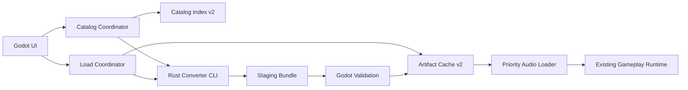

# Java-Free Song Catalog And Gameplay Loading Design

状态: 已完成设计评审, 可以进入 implementation planning.

日期: 2026-07-11.

## 1. 目标

本设计将 Godot rewrite 从运行时依赖 Java exporter 的混合架构迁移为 Java-free 产品, 同时解决以下用户问题:

- `Start` 进入选歌页过慢.
- 搜索和大列表重建过慢.
- Song 与 Chart 难度平铺, 破坏了正确的产品模型.
- 选择难度后首次进入 gameplay 的等待时间不可接受.
- Catalog Refresh 与 gameplay loading 缺少真实、完整、可取消的进度.

最终产品必须完整支持 VOS、O2Jam OJN/OJM、osu!mania `.osu`/`.osz` 和正式的 bundle v2 discovery. 旧 Swing/LWJGL 应用、BMS、SM、SNP 正式退役.

性能合同:

- `Start -> Song Selection Ready`: warm P95 不超过 300 ms.
- 搜索或格式筛选: P95 不超过 100 ms.
- `Chart -> Gameplay Ready`: warm P95 不超过 2 s, cold P95 不超过 5 s.
- 加载 UI 在 100 ms 内出现.
- 后台 scan、prewarm、LRU 与进度处理不得造成不可接受的主线程卡顿.

## 2. 已确认的产品边界

- Song list 只显示歌曲名称.
- 选择 Song 后, 独立 Difficulty Selection 面板显示其 Chart.
- Song Search 只匹配 title 和 source basename, 不匹配完整路径、artist 或难度.
- Format Filter 支持 `O2Jam`, `VOS`, `osu!mania`, `Bundle` 多选, 默认全部选中, 至少保留一个类型.
- 有 catalog cache 时先开放选歌页, 后台 Catalog Refresh 不阻塞用户.
- 选择 Chart 并稳定停留约 300 ms 后只预热当前 Chart.
- Java v1 catalog、bundle 和 audio cache 不迁移, 新版本使用独立 v2 namespace.
- 用户设置、歌曲目录、键位和 gameplay 配置继续保留.
- Gameplay Artifact Cache 默认 10 GB, Settings 最低允许设置为 5 GB.
- 首个完整迁移版本的 hard release gate 是签名后的 macOS Apple Silicon Godot application.
- Rust core、bundle、cache 和 path contract 保持平台无关, 但其他桌面安装包不阻塞本次完成.

领域语言以仓库根目录的 `CONTEXT.md` 为准.

## 3. 当前证据与根因

Godot 产品运行时当前只有两条 Java 必需链路:

1. `song directories -> --export-vos-catalog -> catalog.json`.
2. `selected raw chart -> --export-vos-selected -> gameplay bundle`.

bundle 加载后的 gameplay loop、判定、输入、渲染、音频命令与结算已经由 Godot 实现, 不需要重新移植旧 Java gameplay runtime.

本机真实曲库基线约 5.0 GB, catalog 含 3,919 个 Chart:

| Operation | Wall time |
|---|---:|
| Empty-directory Java CLI | 0.07 s |
| Full catalog | 11.77 s |
| VOS catalog subset | 10.67 s |
| OJN catalog subset | 0.60 s |
| OJN selected export | 2.20 s |
| VOS gameplay JSON only | 0.29 s |
| VOS audio export | 29.34 s |
| VOS selected export total | 31.09 s |

因此 JVM startup 不是主要瓶颈. 根因是每次全量扫描、重复解析同一 Chart、VOS MIDI sample 串行合成、统一写出大量 WAV、cache identity 不完整, 以及 Godot 再次逐 sample 加载.

## 4. 非目标

- 不把整个旧 Java/Swing/LWJGL 应用重写成 Godot.
- 不保留 Java runtime 或 exporter fallback.
- 不迁移 BMS、SM、SNP.
- 不兼容或迁移 Java bundle v1.
- 不在首期实现 GDExtension adapter.
- 不要求 Rust VOS PCM 与依赖 macOS system DLS 的 Java PCM bit-exact.
- 不在本次交付 macOS x86_64、Windows 或 Linux GUI application.

## 5. 总体架构



### 5.1 Godot ownership

Godot 负责:

- 用户设置和 song roots.
- Catalog Coordinator 与 last-known-good index.
- Song grouping、search、format filtering 和虚拟化列表.
- Difficulty Selection 与当前选择.
- Load Coordinator、generation token、prewarm、cancel 和 progress aggregation.
- Artifact Cache policy、LRU、validation 和 atomic publication.
- Gameplay/audio loader 与现有 runtime.
- Settings 中的 cache budget 与 clear actions.

### 5.2 Rust ownership

共享 Rust core 负责:

- 文件发现和 source metadata extraction.
- VOS、OJN/OJM、osu!mania import.
- Normalized Song、Chart、Event 与 Sample model.
- Timing compilation、long-note normalization 和 sample identity mapping.
- MIDI synthesis、audio decode/conversion 和 content deduplication.
- Relocatable bundle v2 generation.
- Deterministic hashing 和 output manifest generation.

Native CLI 是首期唯一 adapter. 它负责 argument parsing、structured progress、result manifest 与 cooperative cancellation, 不拥有 UI、cache eviction 或 gameplay state.

### 5.3 Static assets

Java `render-metadata` exporter 当前生成的内容与 Chart 无关. Canonical skin metadata、font atlas、textures 和 loading assets 必须迁入 `rewrite/godot` 的 `res://` 资源, 不再按 Song 重复生成, 也不得引用源码树绝对路径.

## 6. Catalog Index v2

Catalog Index 是 Godot 可直接读取的 last-known-good 派生数据. 建议逻辑结构如下:

```json
{
  "schemaVersion": 2,
  "generatedAt": "2026-07-11T00:00:00Z",
  "roots": [],
  "sources": {},
  "songs": []
}
```

每个 source record 包含 normalized path、format、size、mtime、companion fingerprints、parse status 与生成的 Song/Chart metadata. Index 写入临时文件并原子替换, 失败时继续使用上一份完整 index.

### 6.1 Refresh flow

1. `Start` 读取 `user://catalog-v2/index.json`.
2. 有缓存时立即构建 Song model 并开放交互.
3. 后台启动低优先级 catalog scan.
4. CLI 先枚举 candidate files, 再只解析新增或 fingerprint 改变的 source.
5. Godot 按 `songId` 增量合并, 保持选择和滚动位置.
6. Scan 完成后原子发布新 index.
7. 单个坏文件只产生诊断, 不清空其他 Song.

Catalog fingerprint 用于快速 reconciliation, 不用于 gameplay artifact correctness:

- 普通文件: normalized path、size、mtime.
- OJN: 同时包含 companion OJM metadata.
- OSZ: archive metadata.
- `.osu`: beatmap 与引用资源 metadata.

### 6.2 Song identity 与 grouping

- OJN file 是一个 Song, playable chart index 是其难度.
- VOS 使用 normalized song package/directory 与 title 形成稳定 `songId`.
- osu!mania 使用 beatmap set directory 或 OSZ package 形成 `songId`.
- Bundle v2 直接声明 `songId`.
- 同 title 但不同 source package 的 Song 不合并.
- Display title 和 search key 不能作为 identity.

### 6.3 UI model

- Song list 使用虚拟化 row model, 不为 3,919 个 Chart 创建完整 Control tree.
- Song row 固定高度且只显示 title.
- Difficulty panel 单独显示 Chart difficulty name、level 与必要的 keys metadata.
- Search 与 Format Filter 只操作内存 index, 不触发 disk scan 或 converter process.
- 当前 Song 只有在 source 被删除或变为不可玩时才清除, 并显示原因.

## 7. Bundle v2 与强 cache identity

Bundle v2 是 relocatable、完整性可验证、content-addressed 的 Chart artifact. 建议目录:

```text
<bundle-key>/
├── bundle.json
├── gameplay.json
└── audio/
    └── <content-hash>.<ext>
```

Static render metadata 不进入每个 bundle.

`bundle.json` 至少包含:

```json
{
  "schemaVersion": 2,
  "complete": true,
  "bundleKey": "sha256:...",
  "converterVersion": "...",
  "soundfont": {
    "version": "...",
    "sha256": "..."
  },
  "songId": "...",
  "chartId": "...",
  "sourceFingerprint": "sha256:...",
  "files": []
}
```

所有 bundle 内路径使用相对路径. `files` 对每个 artifact 记录 relative path、size 和 SHA-256.

Strong bundle key 的 canonical input 包含:

- Source bytes.
- Companion OJM 或 referenced osu assets.
- Selected playable chart identity.
- Bundle schema version.
- Converter version.
- SoundFont hash.
- Static gameplay asset version.

Rust 只写 `user://cache-v2/.staging/<job-id>`. Godot 校验 manifest、schema、hash、size 与 required files 后, 才原子移动到 `user://cache-v2/artifacts/<bundle-key>`.

Java v1 namespace 完全忽略, 不读取、不迁移、不自动删除. Settings 提供独立的 `Clear legacy cache`.

## 8. Native CLI contract

首期命令边界:

```text
open2jam-converter version
open2jam-converter catalog --request <file> --progress <file> --result <file>
open2jam-converter bundle --request <file> --progress <file> --result <file>
```

Request 和 result 使用版本化 JSON. Progress 使用 append-only JSONL. 每个 progress event 至少包含:

```json
{
  "schemaVersion": 1,
  "jobId": "...",
  "sequence": 1,
  "phase": "PARSE_CHART",
  "completedUnits": 1,
  "totalUnits": 1,
  "unit": "chart",
  "currentItem": "..."
}
```

允许的 gameplay phases:

```text
CHECK_CACHE
HASH_SOURCES
PARSE_CHART
COMPILE_TIMING
PREPARE_AUDIO
WRITE_BUNDLE
VERIFY_BUNDLE
PRELOAD_STARTUP_AUDIO
CREATE_GAMEPLAY
READY
```

Godot 只接受当前 generation、相同 `jobId` 且 sequence 严格递增的事件. 总进度单调递增, cache hit 可以真实跳过阶段. `100%` 只能在对应 Ready 状态达成后显示.

CLI 必须提供稳定 exit code 和 machine-readable error code. Human-readable detail 写入 result/log, 不依赖解析 stderr 文本判断业务错误.

## 9. Chart Prewarm 与 Gameplay Ready

1. Chart selection 稳定约 300 ms 后创建新的 Load Generation.
2. 计算 strong bundle key.
3. Cache hit 时验证 completion manifest.
4. Cache miss 时启动 Rust bundle job.
5. Artifact 发布后解析 gameplay contract.
6. 优先加载 BGM 与开局时间窗口的 sample.
7. 创建现有 Gameplay Runtime.
8. 达成 Gameplay Ready 并显示 100%.

所有 MIDI synthesis 和 format conversion 必须在 artifact 发布前完成. Gameplay Ready 表示完整 artifact 已准备、开局工作集已加载、后台 loader 具备足够 lookahead, 不表示所有 sample 都永久驻留内存.

其余 sample 按 first-use time 由 bounded workers 提前加载. Audio playback 使用固定容量 player pool, finished player 归还池中, 不再无限创建 Node.

全局 MIDI sample cache 按 MIDI content、synth contract 和 SoundFont hash 去重, 允许跨 Chart 复用.

## 10. VOS Audio Parity

VOS audio 使用固定、许可允许再分发的 SoundFont. 在 production audio implementation 开始前, 必须完成 license audit、固定精确 asset bytes, 并在仓库或受控 artifact manifest 中记录 version、SHA-256、license 和 provenance.

必须保持:

- MIDI tempo 与 event order.
- Bank/program、note、velocity 和 pan.
- Duration、minimum 60 ms gate 和 500 ms tail.
- 44.1 kHz、stereo、signed 16-bit PCM contract.
- 跨重复执行的 deterministic output.

Java macOS system DLS PCM 不属于 bit-exact gate. 迁移允许一次已记录的 canonical timbre change, 但 duration、onset、channel behavior、silence 与 clipping 必须通过自动验证.

## 11. Cache budget 与 LRU

- 默认 budget 为 10 GB.
- Settings 允许调整, 最低 5 GB, 并可提供更高预设或 Unlimited.
- Budget 覆盖 bundle audio、PCM 与 global MIDI sample cache.
- Catalog Index 不计入该 budget.
- 当前选择、正在 prewarm 或 gameplay 使用的 artifact 必须 pin.
- 超限时后台按 last-used time 淘汰未 pin 的完整 Chart artifact.
- 磁盘不足时先执行 LRU, 仍不足则以 `OUT_OF_SPACE` 结束 job, 不发布半成品.
- Settings 分别提供 `Clear gameplay cache` 与 `Clear legacy cache`.

## 12. Cancellation 与 generation safety

Job state machine:

```text
CREATED -> RUNNING -> SUCCEEDED
                   -> FAILED
        -> CANCEL_REQUESTED -> CANCELLED
```

- Godot 非阻塞启动 CLI 并持有 PID.
- 每个 job 使用独立 staging、progress 与 result files.
- 切换 Song/Chart、返回或取消会使旧 generation 立即失效.
- Godot 先写 cooperative cancel marker.
- Rust 在 file、Chart、MIDI sample 和 output file 边界检查取消.
- Grace period 后仍未退出时, Godot 终止对应 PID.
- Late success 不得更新 UI、发布 cache 或启动错误 Chart.
- 应用启动时清理 stale staging directories.
- `Play` 必须复用当前 Chart 已运行或完成的 prewarm job.

## 13. Error model

稳定 error codes:

```text
UNSUPPORTED_FORMAT
CORRUPT_CHART
MISSING_COMPANION
AUDIO_DECODE_FAILED
SOUNDFONT_FAILED
OUT_OF_SPACE
CACHE_CORRUPT
CONVERTER_CRASHED
CANCELLED
INTERNAL_ERROR
```

处理原则:

- Catalog 中单个坏 source 不阻断其他 Song.
- Catalog Refresh 失败继续使用 last-known-good index.
- Cache corruption 隔离派生 artifact 并自动重建一次.
- 同一 generation 重建再次失败后停止自动重试.
- Gameplay error UI 提供 `Retry`, `Back to song`, `Open logs`.
- 任何错误都不能修改 source song、用户设置或已发布完整 artifact.
- OSZ extraction 必须拒绝 absolute path、parent traversal 和 duplicate unsafe output path.
- Binary parser 使用 checked arithmetic、bounded allocation 和 structured error, 不信任 header count 或 size.

## 14. Format compatibility

### 14.1 VOS

必须移植 VOS segments、GB2312 metadata、playable channel selection、source-channel overlap inference、两组 tick scale、long-note type bit、background/live MIDI split、identical live MIDI deduplication 与 tempo/running-status behavior.

### 14.2 OJN/OJM

必须移植 OJN 三 Chart model、seven-key mapping、autoplay channels、volume/pan nibble semantics、companion resolution, 以及 M30、encrypted OMC、plain OJM dispatch. OMC 17-block rearrangement、stateful XOR、M30 `nami`/`0412` XOR 和 OGG sample namespace 必须进入 golden tests. Native decoder state 必须是 importer-local, 不能保留 Java static global state.

### 14.3 osu!mania

必须支持 mode 3、7K、`.osu`、`.osz`、inherited timing、lane mapping、background sample、custom hitsound、silent sample ID 0、archive-relative audio lookup 与 case-insensitive basename fallback. 非 7K beatmap 继续作为 unsupported playable chart 被过滤.

### 14.4 Bundle

Bundle v2 是正式输入类型. Catalog discovery 读取 `bundle.json`, 校验 complete、schema 与 hashes, 再生成 Song/Chart entry. v1 bundle 不参与 discovery.

## 15. Test 与 golden strategy

Java 删除前冻结独立 golden corpus:

- 每种格式包含 minimal、representative、stress、malformed、truncated、encoding、missing companion/assets 和 multi-chart cases.
- 每个 case 记录 provenance、license、source SHA-256、expected accept/reject 和 error code.
- 固定 Java commit 与 JDK 17 environment 生成 catalog、gameplay、audio manifest、PCM metrics 与必要视觉 oracle.
- Java 删除后 golden 只读, 新实现不能自动更新自身 expected output.

验证层:

1. Parser accept/reject、error category 与 metadata.
2. Catalog order、Song/Chart identity 与字段.
3. Gameplay notes、timing、long-note repair、sample ID、volume 和 pan.
4. VOS deterministic audio behavioral parity.
5. Godot runtime state trace、audio commands 和 result.
6. macOS arm64 application 的真实 audio device、input、fullscreen 和 visual acceptance.

Parser 还必须执行 differential fuzz/mutation tests, old/new implementation 不得 crash 或 hang. 现有会 skip 真实 fixture 的测试必须改成 hermetic corpus, 当前失真的 verification scripts 必须在 Java deletion gate 前修复或替换.

## 16. Performance verification

Benchmark matrix:

- Library size: 1、100、1,000、full 3,919 Chart.
- Format: VOS、OJN/OJM、osu/OSZ、bundle.
- State: cold、warm、cache hit、cache miss、source mutation、cache corruption.
- Audio asset count: small、representative、stress.

每个 stable case 在固定 release build、machine 与 power profile 下执行 warmup 后采集 30 次 measured runs; cold case 至少 10 次. 记录 p50、p95、max、CPU、peak RSS、disk bytes、child process count 与 longest main-thread frame.

任何 accepted SLO 未通过都阻止 Java 删除. Java-free implementation 还必须保证 timeout/error count 为 0, source mutation 不命中 stale cache, production child process 中不存在 Java.

## 17. Migration sequence

### Phase 0: Freeze truth

- 修复当前失真的 verification scripts.
- 建立 hermetic golden corpus 与 provenance manifest.
- 冻结 Java output 和 accepted tolerances.
- 选择并完成 SoundFont license/hash gate.

### Phase 1: Rust contracts

- 建立 shared domain model、error model、progress contract 与 CLI shell.
- 实现 bundle v2、hashing、staging 与 manifest.
- 先完成 OJN/OJM 与 osu!mania importer, 再完成最高风险 VOS/MIDI path.

### Phase 2: Godot catalog and selection

- 实现 Catalog Coordinator、index v2 与 background scan.
- 实现 Song grouping、virtual list、search、Format Filter 与 Difficulty Selection.
- 加入 Start progress、last-known-good fallback 与 selection preservation.

### Phase 3: Load and cache

- 实现 Load Coordinator、generation、prewarm、cancel 与 progress aggregation.
- 实现 strong artifact cache、LRU、settings 与 static assets.
- 改造 priority audio loader 和 fixed player pool.

### Phase 4: Dual-run parity

- Java 与 Rust 对同一 corpus side-by-side.
- 消除所有未解释 semantic difference.
- 运行完整 performance matrix.

### Phase 5: Product cutover

- Godot production 只调用 Rust native CLI.
- 增加 macOS arm64 Godot export preset、native binary signing 与 clean-machine E2E.
- 不提供 Java fallback.

### Phase 6: Delete Java

- 删除 Java source、parsers、exporters、Swing/LWJGL application 和 Java-only tests/tools.
- 删除 `pom.xml`, `.mvn`, JDK/Maven mise tools、JAR launcher 与 jpackage CI.
- 迁移仍需要的 assets 与 documentation.
- 运行 Java absence gate 和最终 package audit.

## 18. Expected file surface

预期新增的主要边界:

```text
native/
├── Cargo.toml
└── crates/
    ├── open2jam-core/
    └── open2jam-cli/

rewrite/godot/
├── assets/
├── export_presets.cfg
└── scripts/
    ├── catalog_coordinator.gd
    ├── load_coordinator.gd
    ├── converter_process.gd
    ├── artifact_cache.gd
    ├── virtual_song_list.gd
    └── difficulty_panel.gd
```

最终删除或替换:

- `rewrite/godot/scripts/exporter_client.gd`.
- `rewrite/godot/scripts/selected_export_job.gd`.
- `rewrite/tools/open2jam-java`.
- `src/` 与 `parsers/` 中已退役 Java surface.
- `pom.xml`, `.mvn`, Java/Maven mise configuration 和 Java packaging workflow.

具体 task-level file list 由 implementation plan 在读取 live code 后展开, 不以本节作为机械修改清单.

## 19. Java deletion gate

只有同时满足以下条件才能宣布 100% migration 完成:

1. Contract scope 已由 VOS、OJN/OJM、osu/OSZ 与 bundle v2 E2E 覆盖.
2. Golden corpus 零未解释 difference.
3. Native/Godot tests 无 skip.
4. Parser fuzz/mutation 无 crash、hang 或 unbounded allocation.
5. macOS arm64 clean machine 无 JDK/JRE/JAR 可完成从空 cache 到 gameplay.
6. 所有 accepted performance budgets 通过.
7. Cache mutation、atomicity、cancel 与 stale generation tests 通过.
8. Packaged application 已签名且不含 Java、Maven、JAR、LWJGL/JNA/VLCJ Java runtime.
9. Repo production surface 不再包含 `OPEN2JAM_JAVA`, `OPEN2JAM_JAR`, `open2jam-java` 或 Java fallback.
10. Java source、build 与 oracle executables 已删除; 只读 golden provenance 可以保留历史 Java commit/JDK 信息.

任一 gate 未通过, 可以继续在 migration branch 使用 Java oracle, 但产品和文档不得声称 Java-free migration 已完成.

## 20. Risks and mitigations

| Risk | Mitigation |
|---|---|
| VOS parser hidden behavior | Hermetic real corpus, differential tests, staged VOS implementation |
| MIDI timbre changes | Fixed redistributable SoundFont, explicit ADR, deterministic behavioral gates |
| Cold VOS misses 5 s | Cross-Chart sample dedupe, parallel synth, Chart Prewarm, profiling before cutover |
| Native CLI packaging | macOS arm64 first, explicit signing pipeline, version handshake at boot |
| Cache corruption or stale data | Strong key, completion manifest, staging, atomic publication, rebuild once |
| Huge libraries block UI | Cached index first, background scan, virtualized rows, incremental merge |
| Cancellation races | Generation token, PID ownership, cooperative cancel, late-result rejection |
| Golden tests preserve Java bugs | Record accepted deviations explicitly; no silent normalization or self-updating goldens |

## 21. Related decisions

- `CONTEXT.md`.
- `docs/adr/0001-cache-gameplay-export-artifacts.md`.
- `docs/adr/0002-use-rust-native-converter-cli.md`.
- `docs/adr/0003-use-deterministic-vos-soundfont.md`.

## 22. Superpowers implementation governance

Production implementation 必须使用 Superpowers workflow, 不允许从本设计直接跳到 ad hoc code edits.

执行顺序:

1. 用户完成本 spec review 后, 使用 `superpowers:writing-plans` 生成 task-level implementation plan.
2. 开始 feature work 前, 按 `superpowers:using-git-worktrees` 判断并建立隔离 worktree, 避免污染当前已有修改.
3. 每个 parser、cache、CLI、Godot flow 与性能 bugfix task 使用 `superpowers:test-driven-development`, 先建立 RED behavior gate, 再做最小实现.
4. 多个边界清晰、状态独立的 task 使用 `superpowers:subagent-driven-development`; 独立 session 执行已批准计划时使用 `superpowers:executing-plans`.
5. 遇到失败、性能回退或未解释 parity difference 时, 在提出修复前使用 `superpowers:systematic-debugging` 定位根因.
6. 每个 milestone 宣称完成前使用 `superpowers:verification-before-completion`, 运行该 milestone 的 narrow gate 与累计 regression gate.
7. 重大 format milestone、runtime cutover 与 Java deletion 前使用 `superpowers:requesting-code-review`.
8. 所有 gate 通过后使用 `superpowers:finishing-a-development-branch` 决定 merge、PR 或保留分支方式.

任何 Superpowers skill 只在对应阶段被实际触发时读取并执行其最新 `SKILL.md`; 本节不以记忆中的旧流程替代届时的 skill contract.
